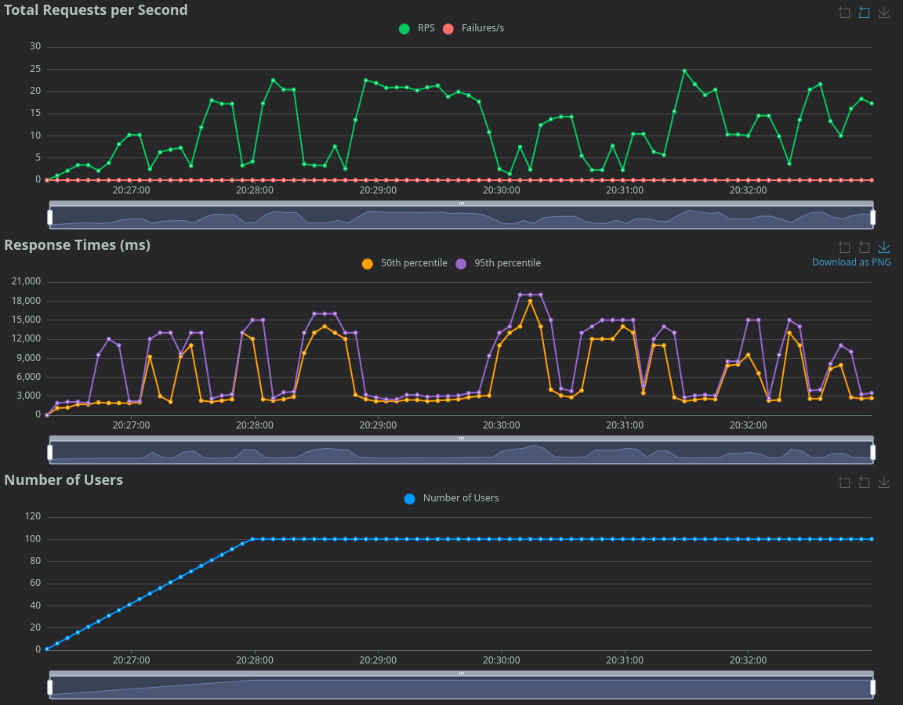
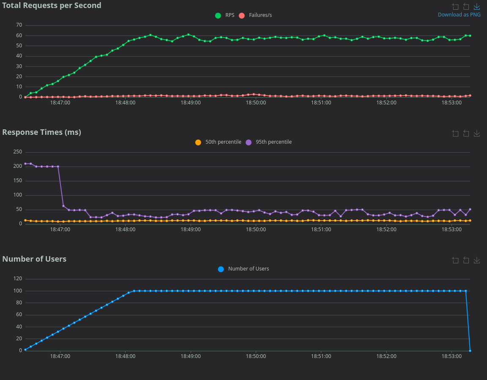

# Migración a Django Rest Framework 0.2v
## Optimización de Rendimiento (14s ➔ 50ms)

Este proyecto documenta la migración de un E-commerce monolítico (Django MVT) a una API RESTful usando Django Rest Framework (DRF), logrando una reducción de latencia del **99.6%** bajo estrés.

## 📊 Resumen

Al enfrentarme a un cuello de botella crítico donde la renderización de templates en el servidor sumado algunas consultas SQL ineficientes (N+1) hacían que el sistema fuera demasiado lento, no permitiendo lograr una experiencia de usuario adecuada.

| KPI (Key Performance Indicator) | Arquitectura Legacy (MVT) | Arquitectura Nueva (SPA) | Factor de Mejora |
| :--- | :---: | :---: | :---: |
| **Tiempo de Respuesta Promedio** | ~5,000 ms (5 seg) | **14 ms (0.01 seg)** | **⚡ 357x Más Rápido** |
| **Tiempo de Respuesta Máximo** | ~19,500 ms (20 seg) | **277 ms (0.3 seg)** | **⚡ 70x Más Rápido** |
| **Transacciones por Segundo (RPS)** | < 12 RPS (Inestable) | **> 51 RPS (Estable)** | **🚀 4x Capacidad** |
| **Tamaño Promedio de Respuesta** | 32 Kb (HTML Completo) | 16 Kb (JSON Data) | **📉 50% Menos Tráfico** |
| **Carga de CPU Servidor** | Crítica (Renderizado HTML) | Baja (Solo JSON) | **Eficiencia** |

> **Nota:** Datos obtenidos mediante pruebas de carga con [Locust](https://locust.io/) simulando 100 usuarios concurrentes interactuando en la app.

---

## 📉 El Problema (Pre-Migración)
La arquitectura original acoplaba la lógica de negocio con la presentación. Cada interacción simple (como "Agregar al carrito") obligaba al servidor a:
1. Recalcular todo el carrito.
2. Renderizar el HTML completo de la página.
3. Enviar una respuesta pesada al cliente.

**Evidencia (Locust Report - Pre Migración):**  
  
*Se observa cómo la latencia se dispara a +10,000ms apenas aumenta la carga.*  

---

## 📈 La Solución (Post-Migración)
Refactorización completa hacia una **API RESTful** con Django Rest Framework y un Frontend reactivo en Vanilla JS.

### Cambios Arquitectónicos Clave:
1.  **Desacoplamiento:** El Backend ahora solo sirve datos (JSON), delegando el renderizado al navegador del cliente.
2.  **Optimización SQL:** Implementación estricta de `select_related` y `prefetch_related` en los ViewSets para eliminar el problema de consultas N+1.
3.  **Estado Optimista:** El frontend actualiza la UI instantáneamente mientras la API confirma en segundo plano.

**Evidencia (Locust Report - Post Migración):**  
  
*La latencia se mantiene plana y constante en ~50ms incluso con la misma carga de usuarios.*  

---

## 🛠 Metodología de Prueba
Para garantizar la veracidad de los datos, se utilizó el mismo escenario de prueba en ambos entornos:

* **Herramienta:** Locust.io
* **Usuarios Concurrentes:** 100
* **Tasa de Creación (Spawn Rate):** 1 usuarios/segundo
* **Escenario:**
    1.  Login de usuario - Paso necesario y que demuestra que no era el problema (No fue migrado).
    2.  Navegación por catálogo (Listar productos) 
    3.  Agregar item al carrito (Acción de escritura crítica)
    4.  Checkout  

### Comparativa Detallada de Endpoints (Percentil 95%)

| Acción del Usuario | Endpoint Legacy | Tiempo (ms) | Endpoint API | Tiempo (ms) |
| :--- | :--- | :--- | :--- | :--- |
| **Agregar al Carrito** | `POST /carrito/agregar` | `14,000` | `POST /api/carrito/` | **`51`** |
| **Ver Catálogo** | `GET /productos` | `14,000` | `GET /api/productos/` | **`25`** |
| **Checkout** | `GET /carrito/finalizar` | `14,000` | `GET /carrito/finalizar` | **`24`** |

---

## 🏁 Conclusión
La migración no solo mejoró la experiencia de usuario eliminando los tiempos de espera, sino que redujo drásticamente los costos operativos requeridos para escalar, ya que el servidor ahora procesa peticiones en milisegundos en lugar de segundos.


---
---

# Plataforma E-Commerce con Django y Docker 0.1v

> Una plataforma de e-commerce full-stack desplegada en un entorno de producción contenerizado, intentando seguir las mejores prácticas de DevOps.

Este proyecto demuestra el ciclo de vida completo del desarrollo de una aplicación web, desde la configuración inicial del código hasta el despliegue final en producción.

## ✨ Stack Tecnológico

_Las tecnologías para este proyecto fueron seleccionadas con un doble propósito:_
* **Backend:** Python, Django
* **Base de Datos:** MySQL
    Fueron elegidos para solidificar y poner en práctica conocimientos previos, así como adquirir experiencia y sumar nuevos conoscimientos.

* **Frontend e Infraestructura (HTML, Bootstrap 5, JS, Docker, Nginx, VPS):**
    Este stack representó un desafío de "aprender haciendo", con el objetivo de adquirir y aplicar desde cero un flujo de trabajo DevOps moderno.

## 🚀 Características Principales

* Gestión de Productos.
* Sistema de Autenticación de Usuarios (Registro, Login, Cambio y Recuperación de Contraseña).
* Carrito de Compras funcional, asíncrono y con una interfaz mínimamente agradable.
* Creación y visualización de Órdenes de Compra.
* Estructura que permite mejoras y nuevas funcionalidades.

## ⚙️ Arquitectura de Despliegue (DevOps)

El núcleo de este proyecto es la implementación de un flujo de trabajo DevOps:

* **Contenerización:** La aplicación Django (con Gunicorn) y la base de datos MySQL corren en contenedores Docker aislados, orquestados con Docker Compose.
* **Proxy Inverso:** Nginx se ejecuta en el servidor anfitrión, gestionando el tráfico público, sirviendo archivos estáticos de forma eficiente y redirigiendo las peticiones dinámicas a la aplicación Django.
* **Seguridad:**
    * Implementación de HTTPS con certificados SSL gestionado por Certbot.
    * Acceso al servidor securizado mediante llaves SSH (deshabilitando contraseñas) El acceso está restringido por un doble firewall (UFW y a nivel de proveedor).
    * Se utiliza Tailscale para crear una red privada virtual (VPN), permitiendo el acceso SSH a través de una IP interna y estable. Esto elimina la necesidad de exponer puertos al público y me ayudo a resolver por completo el problema, tan molesto, de las IPs dinámicas.
    * Gestión de secretos y configuraciones de entorno a través de archivos `.env`.
* **Build de Frontend:** Se utiliza un `Dockerfile` multi-etapa que compila los assets de SASS usando un contenedor de Node.js, optimizando la imagen de producción final, a modo de prueba y aprendizaje de por medio, en bootstrap.
* **Flujo de Trabajo Git:** Se sigue un modelo Git-Flow simplificado con ramas `main` (producción), `dev` (desarrollo) y `feature` (nuevas funcionalidades). 

## Aprendizajes, entre otros desafíos

* **Investigación del Framework:**  
Un desafío clave fue la personalización de los forms de Django para integrarlos con Bootstrap. Esto requirió una comprensión profunda de cómo el framework gestiona la renderización de formularios y la customización de los error_messages.  
El proceso implicó una inmersión en partes del código fuente de Django para rastrear el manejo de errores, permitiendo una personalización precisa.  
Lejos de un dominio completo, esta investigación fue una experiencia de aprendizaje invaluable, que fortaleció la confianza y ayudó a consolidar conceptos importantes, como por ej, el manejo de instancias.

* **Reafirmar buenas prácticas y manejo de Git & GitHub:**  
Durante el despliegue inicial, me encontré con dificultades, perdiendo las buenas prácticas que intentaba seguir.  
Un archivo .env con secretos se filtró accidentalmente al repositorio, lo que motivó una limpieza profunda del historial utilizando la herramienta BFG Repo-Cleaner (a pesar de ser un proyecto de aprendizaje, fue una buena excusa para intentar aprender del error, y pensar en las consecuencias). A esto se sumó el desafío de gestionar por primera vez Git en un VPS y el proceso de despliegie en sí.  
Lejos de ser un error catastrófico, fue una valiosa oportunidad de aprendizaje que sentó las bases para futuros proyectos.

* **Integración de JavaScript Asíncrono (AJAX):**  
Explorar la comunicación dinámica entre el frontend y el backend. Esto implicó la implementación de peticiones asíncronas (Fetch API) desde JavaScript.  
Para interactuar con las vistas de Django sin recargar la página y lograr una mejor experiencia de usuario, al navejar e interactuar por los productos.

## 🛠️ Instalación y Uso Local

1.  Clonar el repositorio: `git clone [URL]`
2.  Crear y configurar el archivo de entorno de desarrollo: `cp .env.example .env.dev`
3.  Levantar los contenedores: `docker compose up --build`
4.  La aplicación estará disponible en `http://localhost:8000`.

## 📦 Carga de Datos Iniciales (Fixtures)

Para poblar la base de datos con datos de ejemplo, existen dos métodos disponibles. Debes ejecutar estos comandos después de haber levantado los contenedores con `docker compose up`.

Antes de poblar la db, asegúrate de que las migraciones de la base de datos se hayan aplicado correctamente con los comandos:
``` bash
docker compose exec web python3 manage.py makemigrations

docker compose exec web python3 manage.py migrate
```

### Método 1: Usando un Archivo Fixture (`loaddata`)

Este método utiliza un archivo de datos predefinido para cargar información específica en la base de datos. Es ideal para cargar un catálogo de productos inicial.

1.  **Prepara tu archivo de datos:**
    Crea un archivo `data.json`. 
    El archivo debe seguir la estructura de fixtures de Django:

    ```json
    [
      {
        "model": "productos.producto",
        "pk": 1,
        "fields": {
          "codigo": "string",
          "nombre": "producto",
          "unidad_medida": "unidad",
          "marca": "marca",
          "descripcion": "descrpición",
          "precio_unitario": "float",
          "stock": [positiveint]
        }
      },
      {
        "model": "productos.producto",
        "pk": 2,
        "fields": {
          "codigo": "string",
          "nombre": "producto",
          "unidad_medida": "unidad",
          "marca": "marca",
          "descripcion": "descrpición",
          "precio_unitario": "float",
          "stock": [positiveint]
        }
      }
    ]
    ```

2.  **Ejecuta el comando `loaddata`:**
    Este comando de Django buscará y cargará el archivo.

    ```bash
    docker compose exec web python manage.py loaddata data/data.json
    ```

### Método 2: Usando un Script Personalizado

Este método es ideal para generar una gran cantidad de datos aleatorios para pruebas de rendimiento o para poblar la base de datos de desarrollo.

1.  **Utilizando el script:**
    El proyecto incluye un script en `productos/scripts/create_random_data.py`.

2.  **Ejecuta el comando `runscript`:**
    Este comando parte de `django-extensions` ejecuta el script.

    ```bash
    docker compose exec web python manage.py runscript productos.scripts.create_random_data
    ```